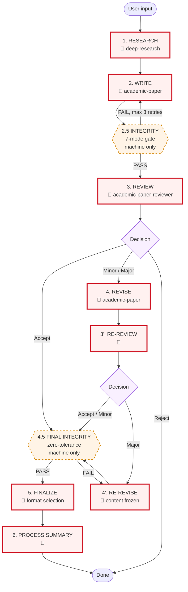
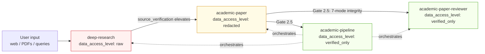
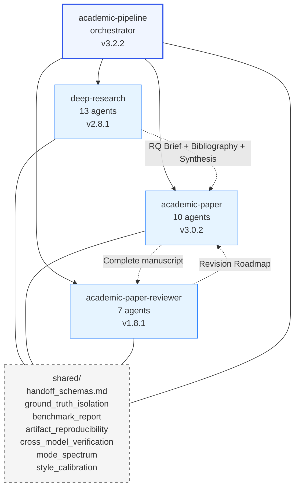
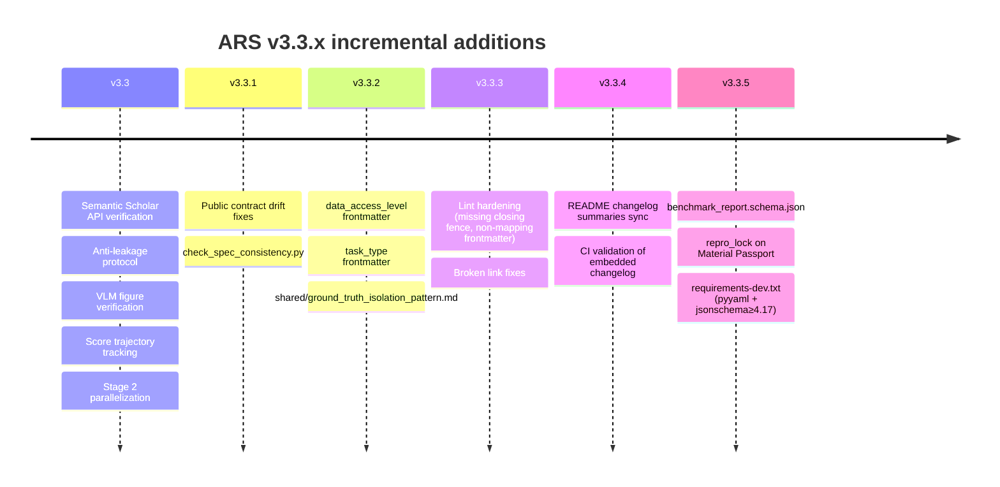

# ARS Pipeline Architecture (v3.3.5)

Full pipeline view across stages × skills × artifacts × gates. Human gates are highlighted with 🧑 — those are the points where user confirmation is mandatory.

## How to read

- **Flow diagram** (§2): macro view — which stage follows which, where loops exist, where gates block. 🧑 markers show human-confirmation points.
- **Matrix** (§3): the only place where (stage × skill × mode × data_level × artifacts × agents × gate) all co-exist. Use this when asking "what happens at Stage X?" Rows with 🧑 in the Gate column require user confirmation.
- **Data access flow** (§4) and **skill graph** (§5): orthogonal views answering "who sees what" and "who depends on what" respectively.
- **Quality gates** (§6): zoom on the blocking checks — both machine-enforced and human-enforced. Crucial for understanding failure modes.
- **Timeline** (§7): why the architecture looks the way it does — each v3.3.x release added one honesty primitive.
- **Modes** (§8): reference when composing a pipeline invocation.

The matrix alone is insufficient: it hides data-access hierarchy and skill dependency. The diagrams alone are insufficient: they hide artifact flow and per-stage agent detail. Together they are the full architecture.

## 1. Human Gates (at-a-glance)

The pipeline has **8 human checkpoints** where the user must confirm before advancing. These are the only places where progress is human-gated; everything else is machine-verified.

| # | Stage | What the user confirms |
|---|---|---|
| 🧑 1 | 1. RESEARCH | RQ Brief + Methodology Blueprint |
| 🧑 2 | 2. WRITE | Outline approval before drafting |
| 🧑 3 | 3. REVIEW | Editor-in-Chief decision (Accept / Minor / Major / Reject) |
| 🧑 4 | 4. REVISE | Revision changes confirmed |
| 🧑 5 | 3'. RE-REVIEW | Verification-review decision |
| 🧑 6 | 4'. RE-REVISE | Content frozen — no further review loop |
| 🧑 7 | 5. FINALIZE | Output format selection (MD / DOCX / LaTeX / PDF) |
| 🧑 8 | 6. PROCESS SUMMARY | Language confirmation + collaboration quality review |

Machine-only gates (no human confirmation): **2.5 INTEGRITY** (7-mode) and **4.5 FINAL INTEGRITY** (zero-tolerance Mode 2).

## 2. Pipeline Flow

**Legend:** solid red border = 🧑 human gate (user confirmation required). Dashed orange border = machine-only gate (automated verification; user sees result but does not approve).

## 3. Stage × Dimension Matrix

| Stage | Skill / Mode | Data level | Artifact produced | Core agents | Gate / Checkpoint |
|---|---|---|---|---|---|
| **1. RESEARCH** | `deep-research` v2.8.1 (full / socratic / lit-review / systematic-review / fact-check / review / quick) | RAW | RQ Brief; Methodology Blueprint; Annotated Bibliography (S2-verified); Synthesis Report; INSIGHT Collection | research_question_agent; research_architect_agent; bibliography_agent; source_verification_agent; synthesis_agent; meta_analysis_agent; editor_in_chief_agent; devils_advocate_agent; risk_of_bias_agent; ethics_review_agent; socratic_mentor_agent; report_compiler_agent; monitoring_agent (13 agents) | 🧑 **Human gate:** user confirms RQ brief + methodology. Machine checks: S2 API Tier-0 verification (Levenshtein ≥ 0.70); evidence hierarchy graded; anti-sycophancy on DA (score 1-5, concede only ≥ 4) |
| **2. WRITE** | `academic-paper` v3.0.2 (full / plan / outline-only / lit-review / revision-coach / abstract-only / citation-check / disclosure / format-convert / revision) | REDACTED | Paper Configuration Record; Outline; Argument Map; Draft Text; Bilingual Abstract; Figures + Captions; Citation List | intake_agent; structure_architect_agent; argument_builder_agent; draft_writer_agent; abstract_bilingual_agent; visualization_agent; literature_strategist_agent; socratic_mentor_agent (plan mode); formatter_agent; revision_coach_agent (10 agents + style/writing quality protocols embedded) | 🧑 **Human gate:** outline approved before drafting. Machine checks: anti-leakage protocol (unsupported fill → `[MATERIAL GAP]`); VLM figure verification (10-pt APA checklist, max 2 refinements); style calibration vs user voice; Stage 2 parallelization (Phase 1 + visualization after outline) |
| **2.5 INTEGRITY** | `academic-pipeline` v3.2.2 (gate) | VERIFIED_ONLY | Material Passport (Schema 9, required) + `repro_lock` (v3.3.5, declared — populated or `null`); Claim ↔ Reference Map (100% verified); Data Provenance Audit | integrity_verification_agent; state_tracker_agent; pipeline_orchestrator_agent | **MANDATORY machine gate (no human confirmation).** 7-mode AI failure checklist (Lu 2026): Mode 1 impl bugs, Mode 2 hallucinated results, Mode 3 shortcut reliance, Mode 4 reframed bugs, Mode 5 methodology fabrication, Mode 6 frame-lock, Mode 7 citation hallucination. FAIL → fix + re-verify (max 3 rounds) |
| **3. REVIEW** | `academic-paper-reviewer` v1.8.1 (full / guided / quick / methodology-focus / calibration / re-review) | VERIFIED_ONLY | Editor-in-Chief Decision (Accept / Minor / Major / Reject); 3× Reviewer Reports (R1, R2, R3); Devil's Advocate Critique; Revision Roadmap; R&R Traceability Matrix | field_analyst_agent (auto-detects domain, configures 3 field-adaptive reviewers); eic_agent; methodology_reviewer_agent; domain_reviewer_agent; perspective_reviewer_agent; devils_advocate_reviewer_agent; editorial_synthesizer_agent (7 agents) | 🧑 **Human gate:** user reviews decision. Machine checks: concession threshold protocol (DA rebuttal scored 1-5, no concede below 4); attack intensity preserved through revisions; cross-model DA critique (optional, `ARS_CROSS_MODEL` env); read-only constraint (no new claims) |
| **4. REVISE** | `academic-paper` v3.0.2 (revision / revision-coach) | REDACTED | Point-by-Point Response; Revised Draft; Delta Report (what changed + why) | revision_coach_agent (v3.3 Socratic mode); draft_writer_agent (re-entry); argument_builder_agent (if structural) | 🧑 **Human gate:** user confirms changes. Machine checks: score trajectory tracked per rubric dimension (v3.3) — revisions that regress a dimension are flagged |
| **3'. RE-REVIEW** | `academic-paper-reviewer` v1.8.1 (re-review) | VERIFIED_ONLY | Verification Review (did revisions address roadmap?); Decision (Accept / Minor / Major) | eic_agent (continuity); same 3 peer reviewers (v1.8 continuity); devils_advocate_reviewer_agent; editorial_synthesizer_agent | 🧑 **Human gate:** user reviews verification decision. Hard cap: **max 1 RE-REVISE round; 2 revision loops total** across Stages 4 + 4'. Major outcome at 3' → Stage 4' (no further review loop). R&R Traceability Matrix updated |
| **4'. RE-REVISE** | `academic-paper` v3.0.2 (revision) | REDACTED | Final Revised Draft (terminal; advances to 4.5) | draft_writer_agent; revision_coach_agent | 🧑 **Human gate:** user confirms content frozen. No further review loop permitted after this stage |
| **4.5 FINAL INTEGRITY** | `academic-pipeline` v3.2.2 (gate) | VERIFIED_ONLY | Updated Material Passport (`verification_status: VERIFIED`) + `repro_lock` populated | integrity_verification_agent (Mode 2 — deeper than 2.5); state_tracker_agent | **MANDATORY machine gate. Zero-tolerance; no skip permitted** (unlike 2.5). Mode 2 is deeper than Mode 1. ANY issue → fix + re-verify. `repro_lock.stochasticity_declaration` required verbatim if populated |
| **5. FINALIZE** | `academic-paper` v3.0.2 (format-convert / disclosure) | VERIFIED_ONLY | Publication-ready MD; DOCX (Pandoc, if available); LaTeX (user confirms); PDF (tectonic); AI Disclosure Statement (venue-specific) | formatter_agent | 🧑 **Human gate:** user selects format before render. Disclosure statement must match venue (ICLR / NeurIPS / Nature / Science / ACL / EMNLP) |
| **6. PROCESS SUMMARY** | `academic-pipeline` v3.2.2 | VERIFIED_ONLY | Paper Creation Process Record (MD + PDF); AI Self-Reflection Report (concession rate, sycophancy risk, health alerts); Score trajectory visualization | state_tracker_agent; pipeline_orchestrator_agent | 🧑 **Human gate:** language confirmed with user. Collaboration quality evaluated. Post-publication audit report (if peer-review published) |

## 4. Data Access Level Flow (v3.3.2+)

Rules (from `shared/ground_truth_isolation_pattern.md`):
- `raw` skills consume layer-1 data (arbitrary, possibly adversarial)
- `redacted` skills operate on sanitized material, no new raw ingestion
- `verified_only` skills run only after upstream integrity gates
- No skill ever reads ground-truth / rubrics / gold labels within the same process as producing a response

## 5. Skill Dependency Graph

## 6. Quality Gates

Two classes of gate: **🧑 human** (user confirmation required) and **🤖 machine** (automated verification, no user approval).

| Gate | Class | Stage | What blocks advancement | Failure handling |
|---|---|---|---|---|
| RQ + methodology confirmation | 🧑 | 1 | User hasn't approved RQ Brief and Methodology Blueprint | Revise and re-present |
| S2 API verification | 🤖 | 1 | Citation not in Semantic Scholar; title Levenshtein < 0.70 | Flag; user decides to drop or re-cite |
| Outline approval | 🧑 | 2 | User hasn't approved outline | Revise and re-present |
| Anti-leakage (v3.3) | 🤖 | 2 | Draft contains parametric fill not grounded in session materials | `[MATERIAL GAP]` tag; user provides material or accepts gap |
| VLM figure verify (v3.3) | 🤖 | 2 | Rendered figure fails 10-pt APA 7.0 checklist | Max 2 refinement iterations |
| Stage 2.5 integrity | 🤖 | 2.5 | Any of 7-mode AI failure checklist | Fix + re-verify; max 3 rounds |
| Editor-in-Chief decision review | 🧑 | 3 | User hasn't reviewed decision letter | Present decision; await user |
| Concession threshold | 🤖 | 3 | DA rebuttal scored < 4/5 by responder | No concession; frame-lock detector runs |
| Revision confirmation | 🧑 | 4 | User hasn't confirmed changes | Revise; re-present |
| Revision loop cap | 🤖 | 4 / 3' / 4' | 2 revision loops already consumed | Forced advance to Stage 4.5 |
| Content-frozen confirmation | 🧑 | 4' | User hasn't confirmed freeze | Await user; no further review loop permitted |
| Stage 4.5 final integrity | 🤖 | 4.5 | ANY issue on Mode 2 deep check | ZERO-tolerance; no skip; fix + re-verify |
| Format selection | 🧑 | 5 | User hasn't chosen output format | Await user format choice |
| Disclosure check | 🤖 | 5 | Venue-specific AI disclosure absent or wrong form | Block render until fixed |
| `repro_lock` (v3.3.5) | 🤖 | 4.5 | Missing key, missing `stochasticity_declaration`, or invalid `hash_timing` | Lint fails; CI errors |
| Language + collaboration review | 🧑 | 6 | User hasn't confirmed output language / reviewed self-reflection | Await user |
| `benchmark_report` (v3.3.5, external) | 🤖 | — | Publishing a benchmark without honest disclosure | Users run `check_benchmark_report.py` before publishing |

## 7. v3.3.x Evolution Timeline

## 8. Skill Modes

| Skill | Modes |
|---|---|
| `deep-research` v2.8.1 | full, quick, socratic, review, lit-review, fact-check, systematic-review (7) |
| `academic-paper` v3.0.2 | full, plan, outline-only, revision, revision-coach, abstract-only, lit-review, format-convert, citation-check, disclosure (10) |
| `academic-paper-reviewer` v1.8.1 | full, re-review, quick, methodology-focus, guided, calibration (6) |
| `academic-pipeline` v3.2.2 | (orchestrator — delegates to sub-skill modes; no standalone modes) |
